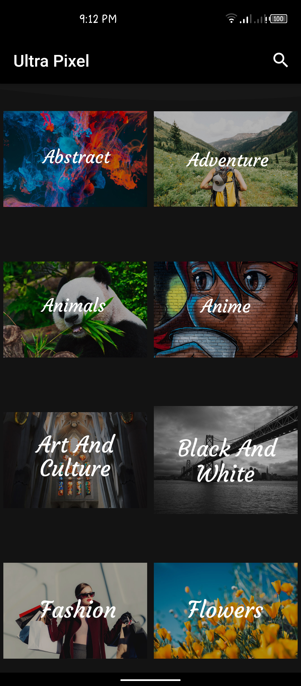
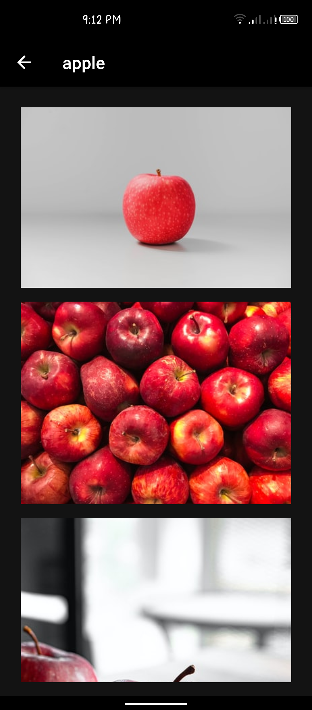
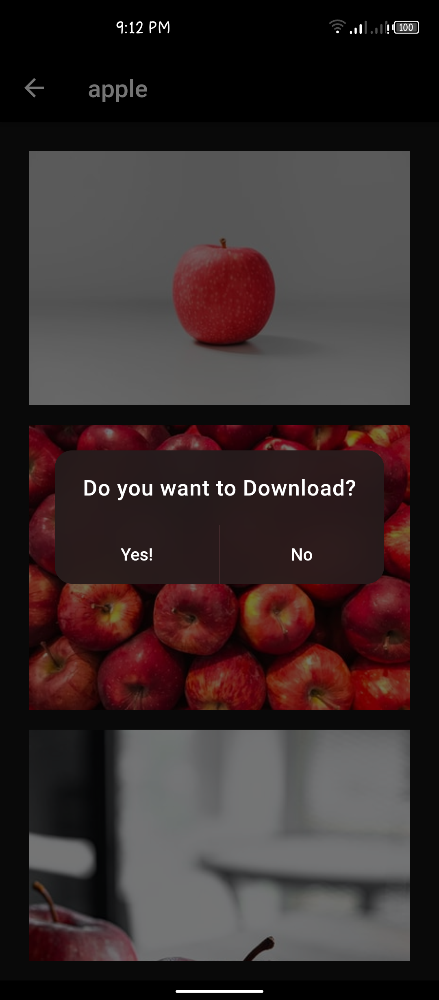

## Flutter-Ultra-Pixels-Wallpaper-App

This is my very first project on flutter and this one is version 1.0.0. I know it needs a alot of changes as learning will never ever ends and I also try to improve my skills
so please dont judge me only this single project as it is my first flutter project. THANK YOU

### INTRODUCTION

This is a wallpaper app from where you can download any type of wallpaper or images by searching. I am using the UNSPLASH API for getting the images . you can request API KEY from https://unsplash.com/documentation. 

### SCREENSHOTS

The first page is the home page where you get some by default categories, by clicking on this categories you can get the respective images.

You can also search any category as you can see in below screenshort I search for apples.

Then you can click on the image you like and you get a popup for download, so by click on yes the image is downloaded.

Your image is downloaded in the the following path of your mobile phone. Go to file manager then

Android/data/com.example.ultra_pixels/files/https/images.unsplash.com/

At this path you found your downloaded image.

### GENERATE APK

To generate APK file first clone the repository and open terminal and navigate to the ultra pixel folder and write the following command:

flutter build apk

By run this command you have new folder named build in ulter pixel project. navigate to
build/app/outputs/apk/release/

here you have apk file 

install this apk on your android phone and enjoy!!!

